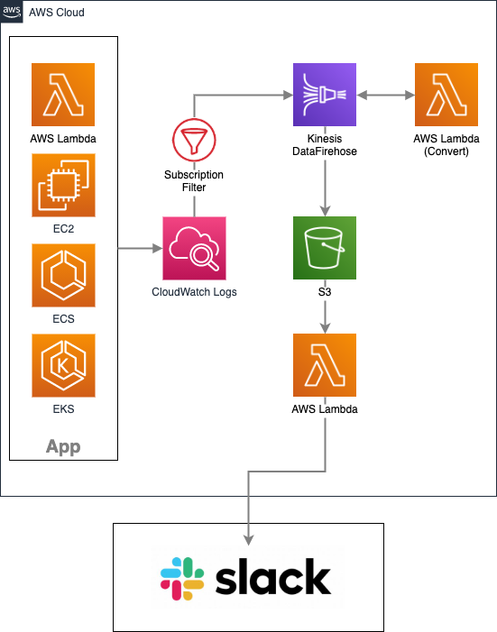

# cwl-transfer-slack-sample  

1. [What is?](#what-is?)  
1. [Architecture.](#architecture)　　
1. [Usage](#usage)  
  
## What is?  
CloudWatch Logsに出力されたログ本文をSlackに転送させる為のアーキテクチャを作成する為のサンプルコードです。  
詳細は、[この記事](https://masakimisawa.com/cwl-to-slack)をご参照ください。  

## Architecture　　
全体構成です。  

  
## Usage  
以下の手順でリソースを作成していくことで、上記アーキテクチャを作成可能です。  
  
1. S3バケットの作成  
`バケット名はリージョン全体でユニークの為、cwl-transfer-slack-sample-bucket の部分は任意のバケット名に置き換えてください。`  
```
$ cd src/resource/s3
$ terraform init
* locals.tfのbucketを任意のバケット名に書き換えて保存 *
$ terraform apply
```